<div align="center">
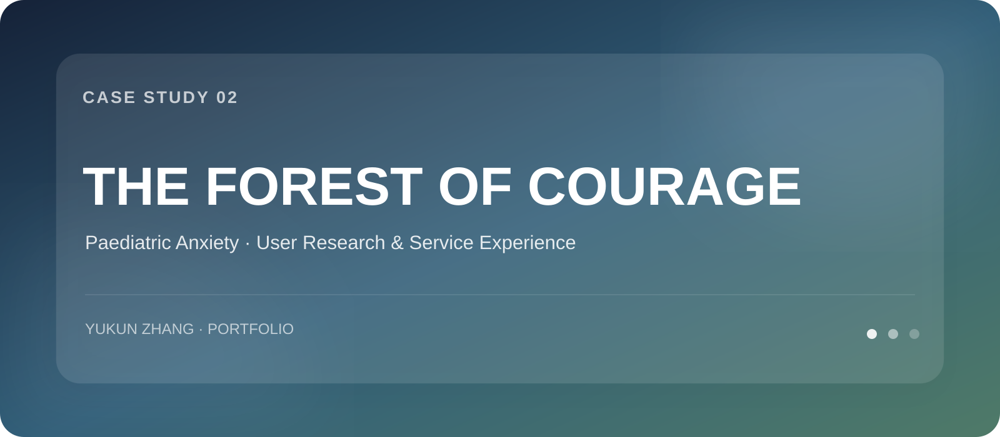

<br>

[](../README.md)
</div>

# The Forest of Courage
### 儿童医疗焦虑体验优化｜User Research & Service Experience Design

**项目类型：** User-centred Design / Service Experience  
**成绩：** **85 / 100 · High Distinction**  
**我的贡献：** Literature Search · Prototype Testing & Interview Arrangement · Process Review · Concept Presentation

---

## 01｜The Challenge

儿童医院体验不仅是“完成治疗”，也是一段由陌生环境、等待、不确定性和医疗操作共同构成的情绪旅程。

项目以儿童医疗焦虑为切入点，核心关注 4–5 岁儿童，并探索：

> **如何通过持续陪伴、可预期的信息、游戏互动与多感官体验，降低儿童在医院中的恐惧与失控感？**

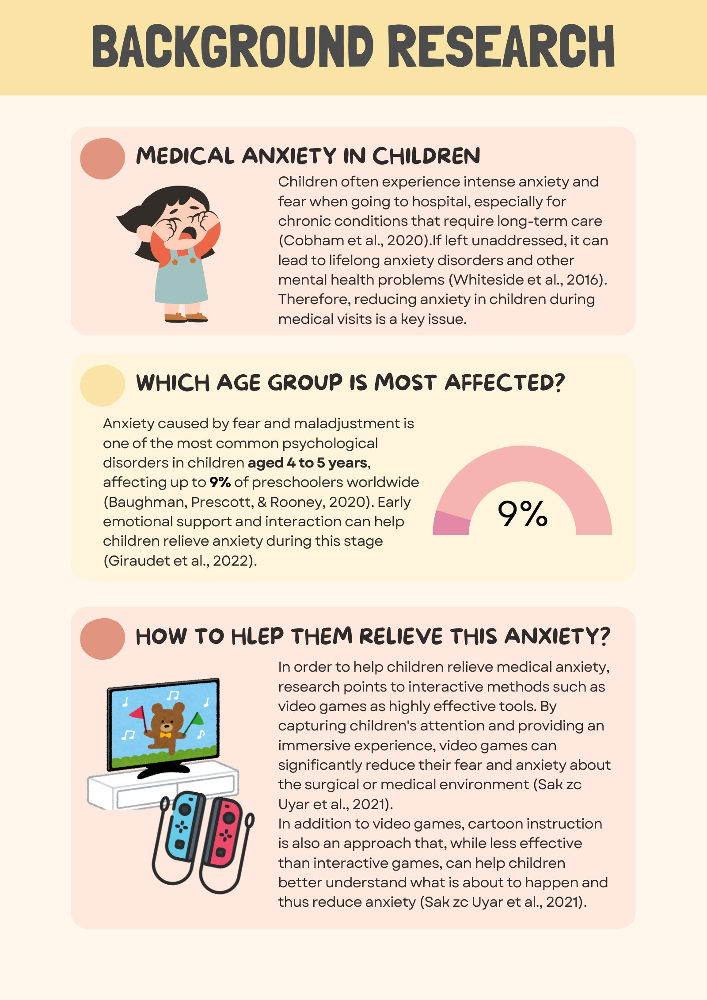

---

## 02｜Background Research

研究显示，互动式方法（如游戏）可以通过吸引注意力和建立沉浸体验缓解医疗焦虑。团队同时分析 Boston Children's Hospital 的 Family Medical Coping Initiative，从中提炼出 Medical Play、Child-friendly Explanation、Multidisciplinary Support 等方向。

项目不是简单复制已有解决方案，而是进一步寻找：

- 怎样把“提前告知”变成可理解的儿童体验？
- 怎样让儿童从被动患者转变为参与者？
- 怎样让陪伴贯穿到院前、院内和后续复诊？

---

## 03｜Initial Concept

最初概念将医院体验重新包装为一次 **Forest Adventure**：

1. 儿童在去医院途中进入 App
2. 选择 Adventure Buddy
3. 到医院找到实体 Buddy
4. Buddy “生病”，由儿童陪它去治疗
5. 医生先对 Buddy 演示治疗
6. 儿童通过游戏与陪伴降低未知感
7. 完成治疗后获得奖励
8. Buddy 在未来复诊继续陪伴

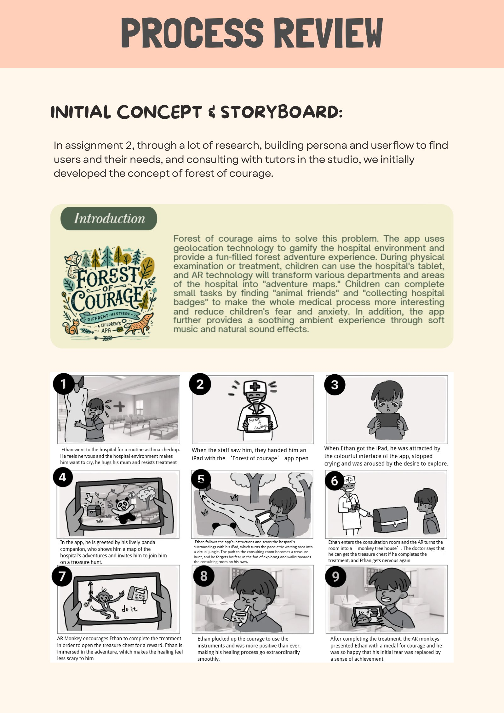

---

# 04｜Prototype Testing & Iteration

这一项目最核心的工作不是最终 UI，而是 **三轮测试 → 反馈 → 改进**。

### Round 1 · 验证注意力与基本互动

**8 次测试**，比较提前告知 / 不提前告知、bubble wrap / colouring、不同音乐与互动形式。

**What worked**
- 游戏活动能转移对医疗场景的注意
- Forest-themed environment 被积极接受

**What failed**
- “Adventure” 感不足
- 互动与沉浸感不够
- Geolocation 不突出

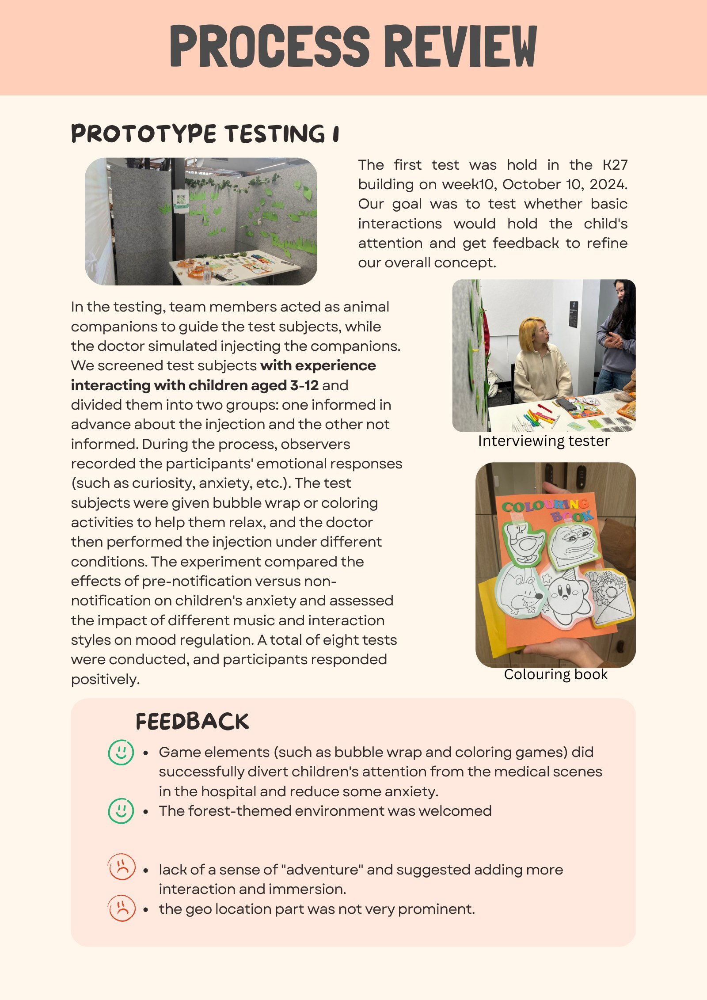

### Round 2 · 强化 Buddy 与 Geolocation

在咨询 3 位 tutor 后，团队当天修改测试计划、访谈问题并增加原型，随后进行了 **13 次测试**。

主要变化：
- 加入 Toy Store / Adventure Buddy 选择过程
- 让 Buddy 先成为需要治疗的对象
- 通过陪伴关系降低儿童对治疗的未知与恐惧

新的反馈指出：
- Buddy 能增强连接感
- 虚拟森林提高沉浸感
- 需要加入气味与更丰富的 Buddy 背景
- 突然注射仍可能造成警觉

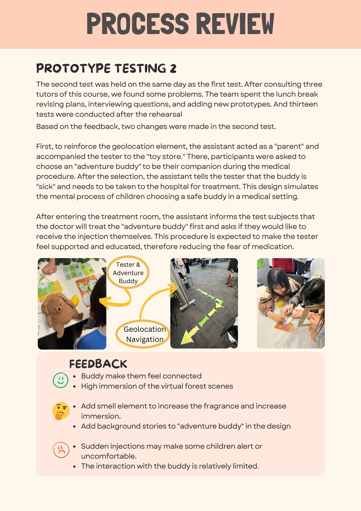

### Round 3 · 情绪记录与多感官体验

第三轮共有 **10 位参与者**，进一步加入：

- Lavender fragrance
- Mood Selection Board
- 更明确的空间距离与导航
- 更完整的虚拟森林氛围

Mood Board 不只是装饰，而是用于记录不同体验阶段中的情绪变化，为后续迭代提供结构化观察依据。

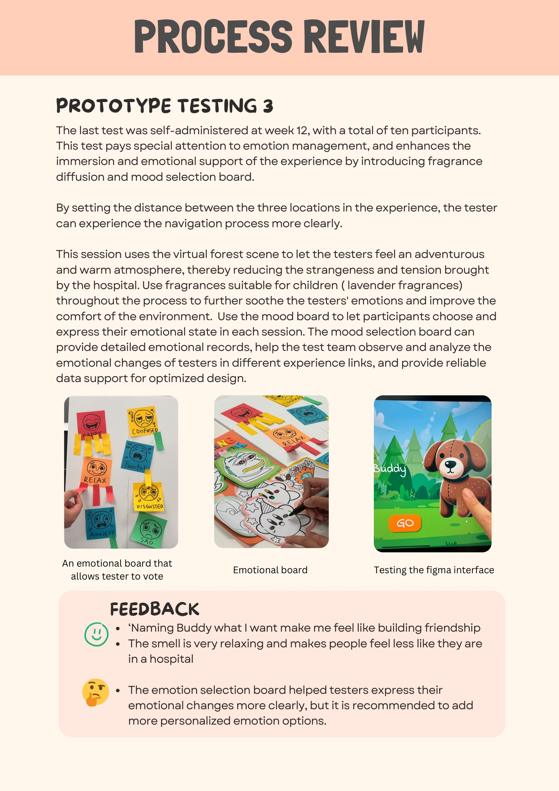

---

## 05｜The Iteration Logic

```text
TEST 01
Basic interaction works
      ↓
Immersion / adventure is weak
      ↓
TEST 02
Add Buddy + Geolocation
      ↓
Emotional connection improves
      ↓
Need richer sensory & emotion support
      ↓
TEST 03
Add scent + Mood Board + clearer navigation
```

这段迭代过程让我真正理解：

> **原型测试的目的不是获得“喜欢/不喜欢”，而是发现具体哪一部分机制需要改变。**

---

## 06｜Final Experience Journey

最终体验覆盖一次就诊前后，而不是仅发生在诊室中：

| Stage | Experience |
|---|---|
| **01 · Reservation** | 家长完成预约 |
| **02 · Preparation** | 医院提前发送 Adventure Invitation |
| **03 · Journey** | 去医院途中进入 Forest of Courage，选择 Buddy |
| **04 · Arrival** | 到 Toy Store 找到实体 Buddy，并由 App 导航 |
| **05 · Treatment** | 医生先为 Buddy 演示治疗，儿童逐步参与 |
| **06 · Ongoing** | Buddy 在未来复诊中持续陪伴 |

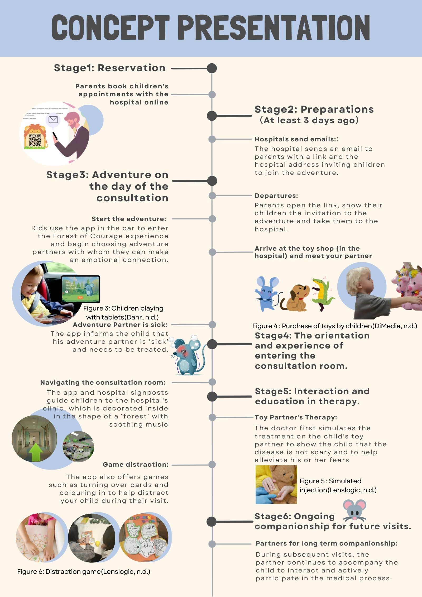

---

## 07｜Interface & Storytelling

<table>
<tr><td>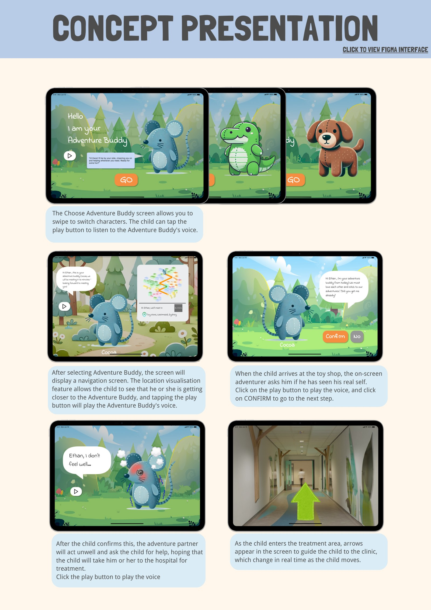</td><td>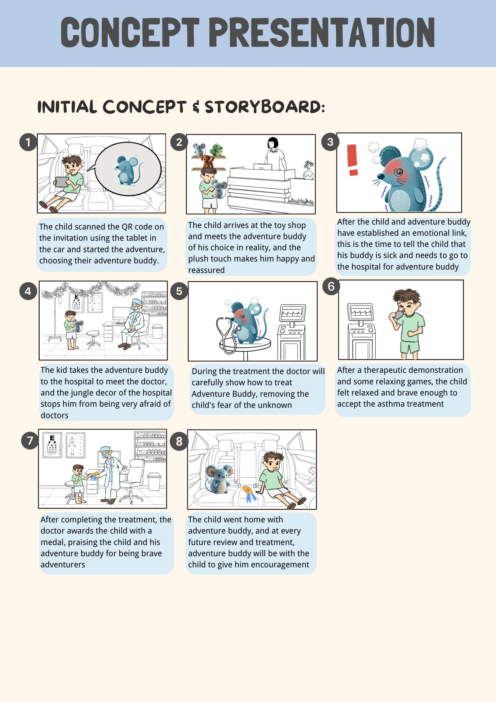</td></tr>
</table>

UI 负责选择 Buddy、语音、位置可视化和医院内导航；Storyboard 则帮助我们确认情绪节奏与服务触点是否连续。

---

## 08｜My Contribution

项目最终报告记录了我的具体分工：

- **Literature Search**：儿童医疗焦虑、互动干预与体验研究
- **Prototype Testing & Interview Arrangement**：参与测试组织与访谈安排
- **Process Review**：整理迭代逻辑和测试反馈
- **Concept Presentation**：参与最终概念结构与表达

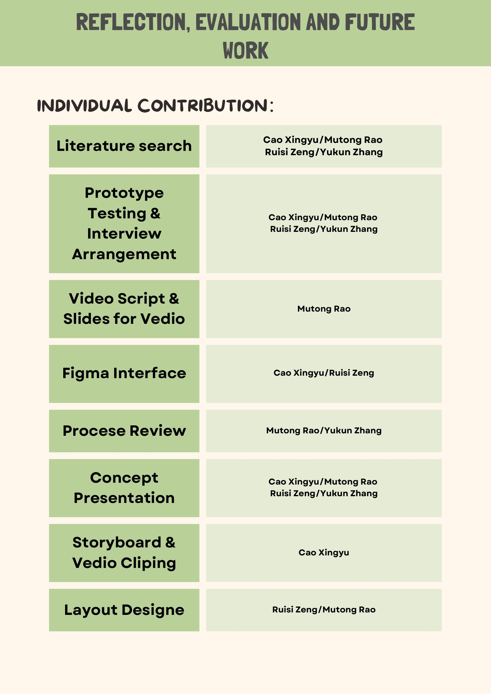

---

## 09｜Research Limitation

一个重要限制是：**我们无法直接对真实儿童患者进行最终用户测试。**

因此，现有结果应被理解为 **directional design evidence**，而不是临床有效性验证。团队也识别出故事深度和对低兴趣儿童的吸引力等不足。

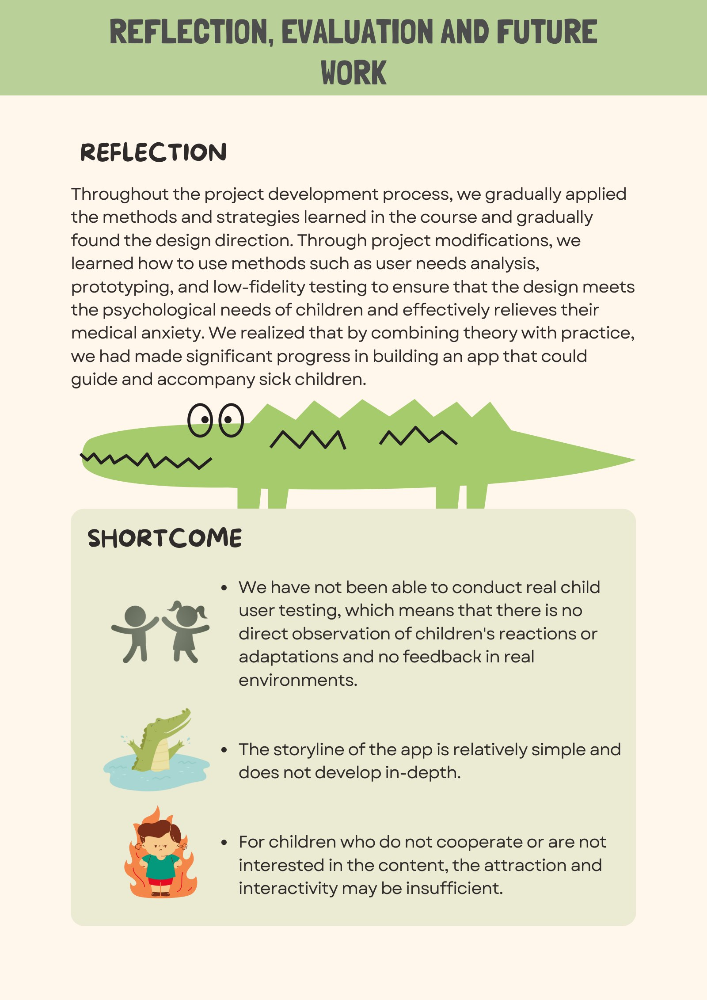

---

## 10｜Outcome

**Final Grade: 85 / 100 · High Distinction**

最终方案将：

`Geolocation` · `Adventure Buddy` · `Game Distraction` · `Multisensory Environment` · `Emotional Tracking`

组合成一条连续的儿童就医体验路径。
