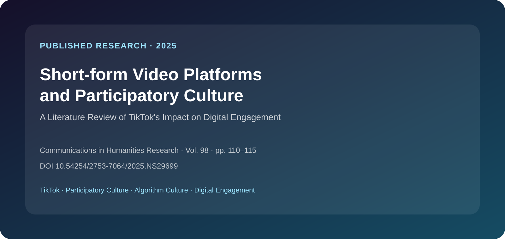
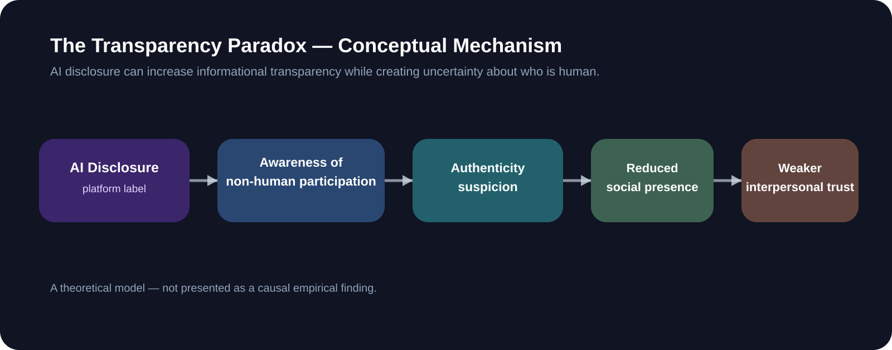
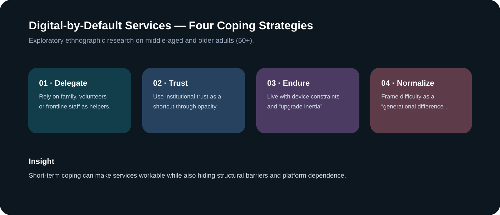

 

# Selected Research
### Media · AI · Platform Culture · Digital Ethnography

我的研究主要关注：**数字平台如何改变内容生产、用户参与、信任与社会包容。**

---

## 01｜Published Research

### Short-form Video Platforms and Participatory Culture: A Literature Review of TikTok's Impact on Digital Engagement

**Yukun Zhang**  
*Communications in Humanities Research, Vol. 98, pp. 110–115*  
**Published: 19 November 2025**

### Research Focus

这篇文献综述讨论 TikTok 如何将 Web 2.0 时代的参与式文化进一步推向 **algorithmic mobile participation**。研究重点包括：

- 算法推荐如何重新分配内容可见度
- 低门槛创作工具如何扩大文化参与
- “democratized virality” 如何改变创作者机会
- 算法中介、创作者 agency 与 authenticity 之间的新张力

`TikTok` `Short-form Video` `Participatory Culture` `Digital Engagement` `Algorithm Culture`

---

## 02｜Research Manuscript

### The Transparency Paradox of AI Agent Disclosure: Interpersonal Trust in Social Media Comment Sections

**类型：** Theoretical / Mechanism-oriented Case Analysis  
**状态：** Research Manuscript

当 AI Agent 开始不仅生成内容，还直接作为“评论者”参与社交互动时，一个新的问题出现：

> **当平台明确标记 AI-generated comments，透明度是否反而会让用户更怀疑其他评论者是否是真人？**

研究提出 **Transparency Paradox**：AI 标签提高信息透明度的同时，也可能让用户注意到非人参与，从而引发 authenticity suspicion、降低 social presence，并削弱对评论区其他参与者的 interpersonal trust。

研究结合：

- Social Bots / Human-Agent Interaction
- Social Presence Theory
- Online Credibility Cues
- Platform Governance
- AI Disclosure Policies

> 该模型是理论机制，不把路径呈现为已经得到因果验证的实证结论。

---

## 03｜Ethnographic Research

### How Do Digital-by-Default Services Shape Middle-aged and Older Adults’ (50+) Coping Strategies and Reinforce the Digital Divide?

**类型：** Ethnographic Research Essay · 2026  
**方法：** 2 次半结构化访谈 + 非正式公共服务场景观察 + 理论分析

研究关注中国“digital-by-default”公共与商业服务如何塑造 50+ 用户的日常应对，并讨论这些应对方式为什么可能在短期解决问题的同时，长期稳定数字排斥。

### Four Coping Strategies

1. **Delegating to helpers** — 将数字任务交给家人、志愿者或一线工作人员
2. **Institutional trust** — 在不理解系统的情况下依赖机构信誉
3. **Upgrade inertia** — 忍受旧设备、更新与兼容性问题
4. **Normalizing exclusion** — 将困难解释为“代际差异”

### Reflection

这项研究同时明确承认样本较小：两名访谈对象不足以支持主题饱和，因此结论被定位为 **exploratory**，而非总体代表性结论。

这一限制也让我更加重视：

- 对研究者 positionality 的反思
- 区分“典型案例”与“可推广结论”
- 在用户研究中明确证据边界

---

## Research Themes

| Theme | Questions I Care About |
|---|---|
| **AI & Trust** | AI 参与内容互动后，人如何判断真实性与可信度？ |
| **Platform Culture** | 推荐机制如何塑造参与、创作与可见度？ |
| **Digital Inclusion** | 技术系统默认的“理想用户”是谁？谁会被排除？ |
| **Cross-cultural Content** | 内容在不同语言、文化与平台语境中如何被理解？ |
| **User Research** | 如何用有限证据形成清晰但不过度外推的洞察？ |

---

## Current Interest

**AI × Content × Culture**

我希望继续研究 AIGC、AI Agent、平台文化、短视频、Meme / 抽象文化与跨文化内容理解，并将学术研究方法转化为现实产品中的内容策略、用户洞察和模型评估问题。
