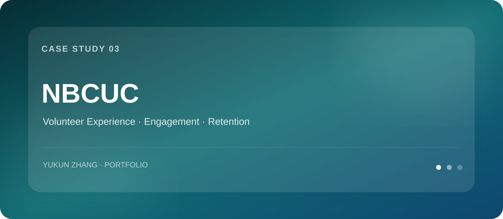
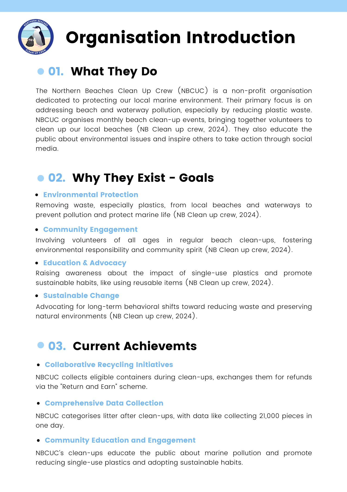
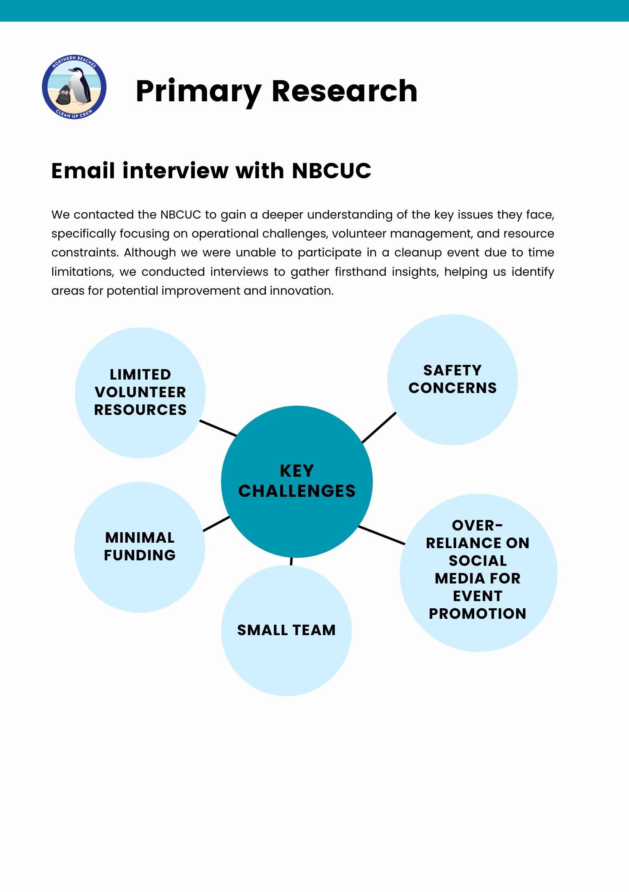
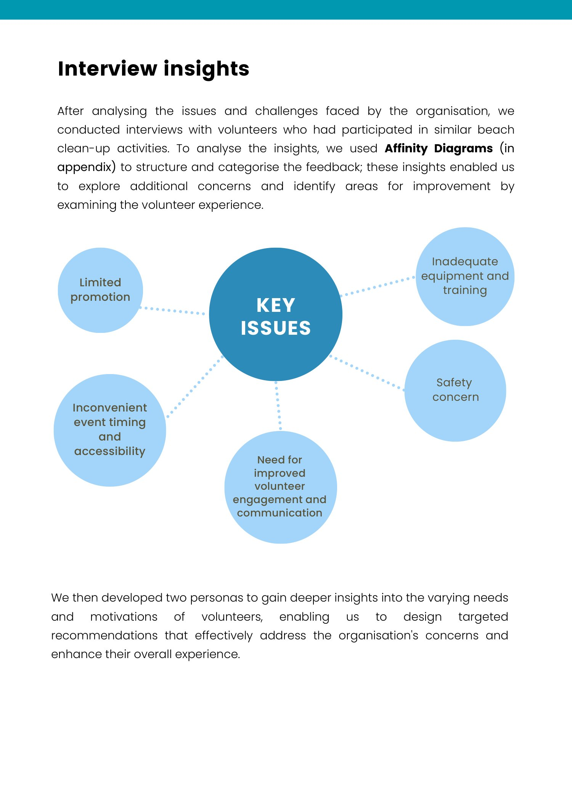
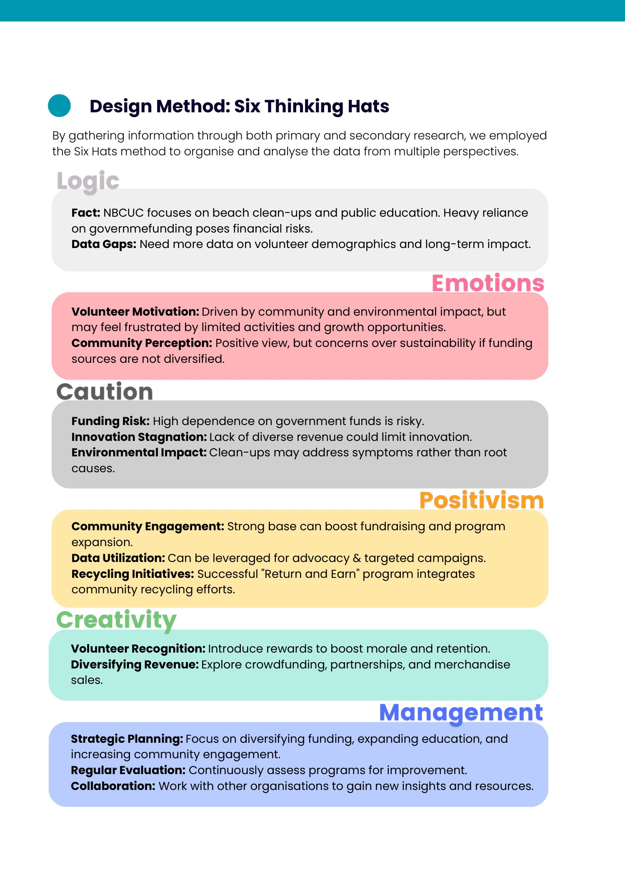
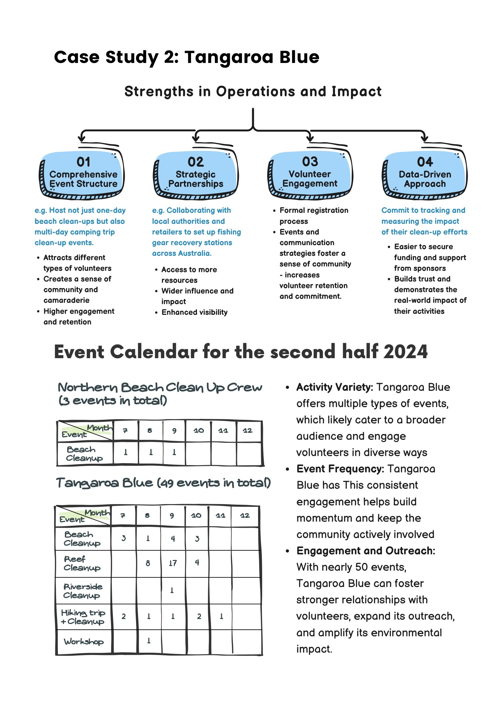

 

# Northern Beaches Clean Up Crew
### 志愿者体验、组织运营与长期参与研究

**项目类型：** Qualitative Research / Strategy  
**关键词：** `Volunteer Research` `Affinity Diagram` `Benchmarking` `Community Engagement`

---

## 01｜Research Question

志愿者组织经常能吸引第一次参与者，但更难解决：

> **怎样让参与过程更安全、更清晰、更有成就感，并形成长期参与？**

---

## 02｜Primary Research

团队通过与 NBCUC Founder 的 Email Interview 了解组织现实约束，包括：

- 活动现场首先需要考虑志愿者安全，参与者中也有儿童
- 活动通过网站与社交媒体发布，没有 booking system
- 装备依靠捐赠与 grants / Return and Earn 资金购买
- 社交媒体与活动推广主要由一名同时全职工作的志愿者承担
- 过去曾长期记录海洋垃圾数据，但受时间与人力限制已难以持续

---

## 03｜Affinity Analysis

我们将志愿者痛点与建议聚类为五个关键主题：

### ① Equipment & Safety
可靠装备、安全 briefing、first-aid 与适合不同场地的工具直接影响参与信心。

### ② Communication & Organisation
活动说明、临时变更和现场任务分配如果不清晰，会造成低效率与挫败。

### ③ Recognition & Motivation
重复劳动、缺乏认可和社交连接会削弱长期动机。

### ④ Scheduling & Accessibility
活动时间、持续时长、公共交通和停车条件影响可达性。

### ⑤ Long-term Impact
志愿者希望看到持续效果；如果清理后很快恢复污染，会产生“努力是否有意义”的怀疑。

---

## 04｜From Findings to Strategy

为了避免直接从痛点跳到解决方案，团队继续使用案例研究与 Six Thinking Hats 对问题进行结构化分析。

其中一个重要判断是：志愿者体验并不只由“环保动机”决定，而受到 **安全、组织能力、活动多样性、反馈、资源与社区关系** 的共同影响。

---

## 05｜Benchmarking

我们分析了其他环境组织的活动结构与合作方式。例如 Tangaroa Blue 展示了更高的活动频率、多样化活动类型、正式注册流程、impact tracking 与 strategic partnerships。

这些案例帮助我们把建议从单次活动优化提升到：

- Volunteer Recognition
- Resource Sharing
- Strategic Partnerships
- Education & Outreach
- Data / Impact Tracking
- More Diverse Event Formats

---

## 06｜What I Learned

这个项目让我意识到一个很重要的研究思路：

> **“参与”不等于“留存”。用户愿意第一次加入，不代表体验机制足以支持长期投入。**

这套分析方式也可以迁移到：

`Community Operations` · `User Retention` · `Volunteer Management` · `Engagement Strategy`
