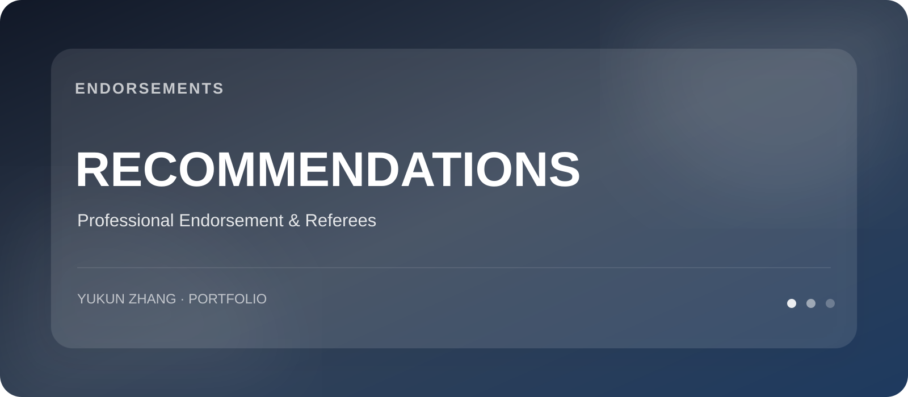

 

# Recommendations & Referees

推荐信通常包含签名、私人邮箱、联系方式和针对特定申请的内容，因此我不会把完整原件公开上传至 GitHub。

---

## Professional Endorsement

### BlueFocus · Automotive Division

已有正式工作/实习推荐材料对我的表现给予了积极评价，重点涉及：

- 信息搜集与数据分析
- 跨部门沟通与项目推进
- 快速学习与独立思考
- 营销项目执行
- 面对挑战时的主动性与责任感

