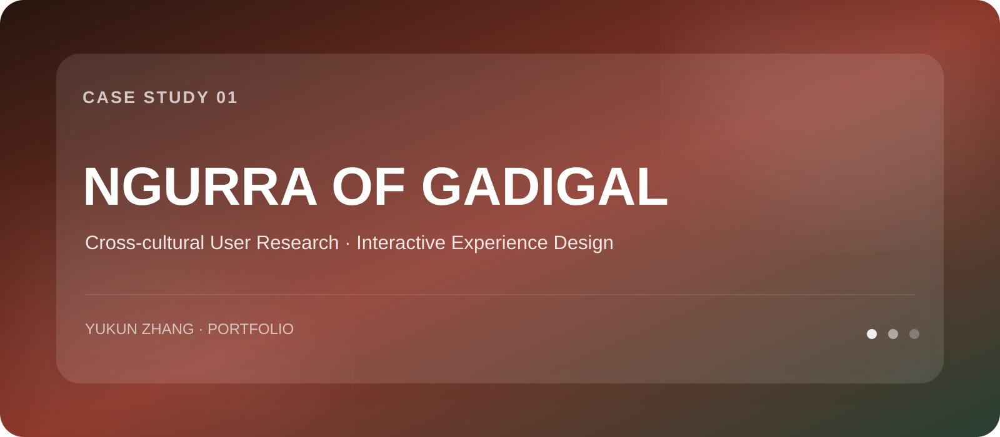
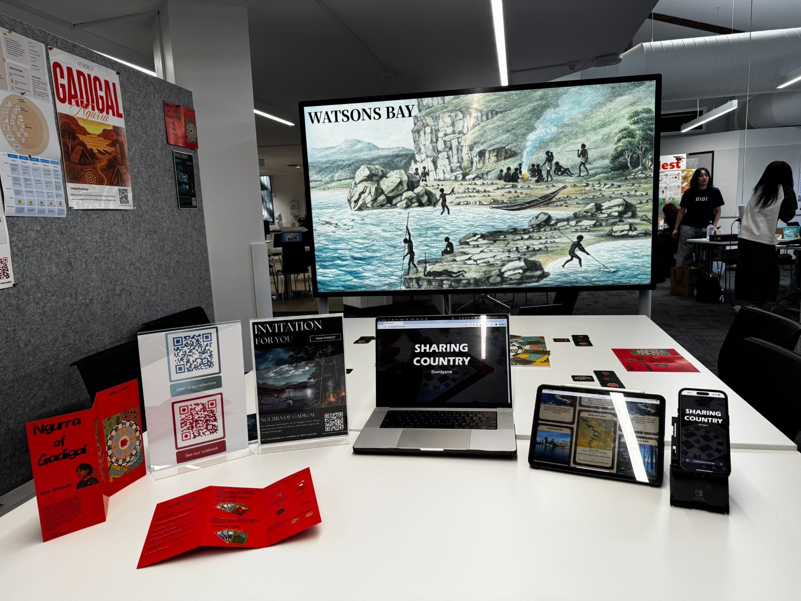
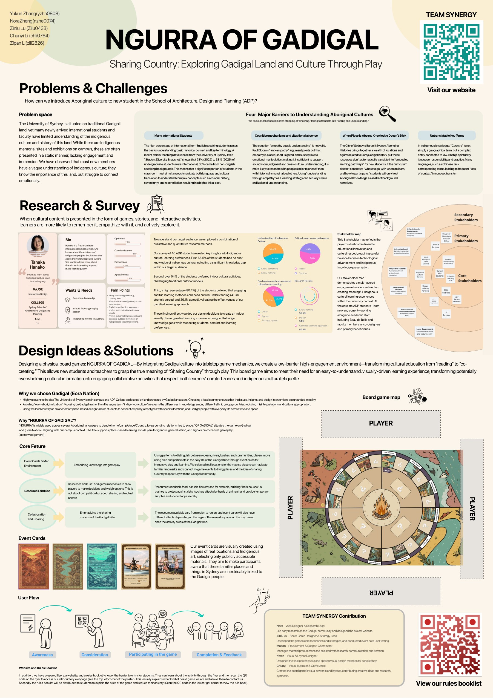
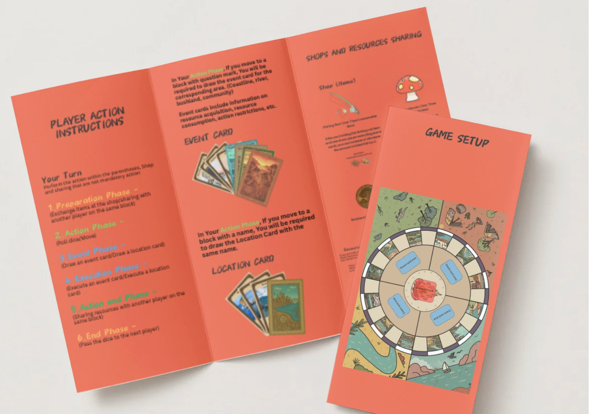
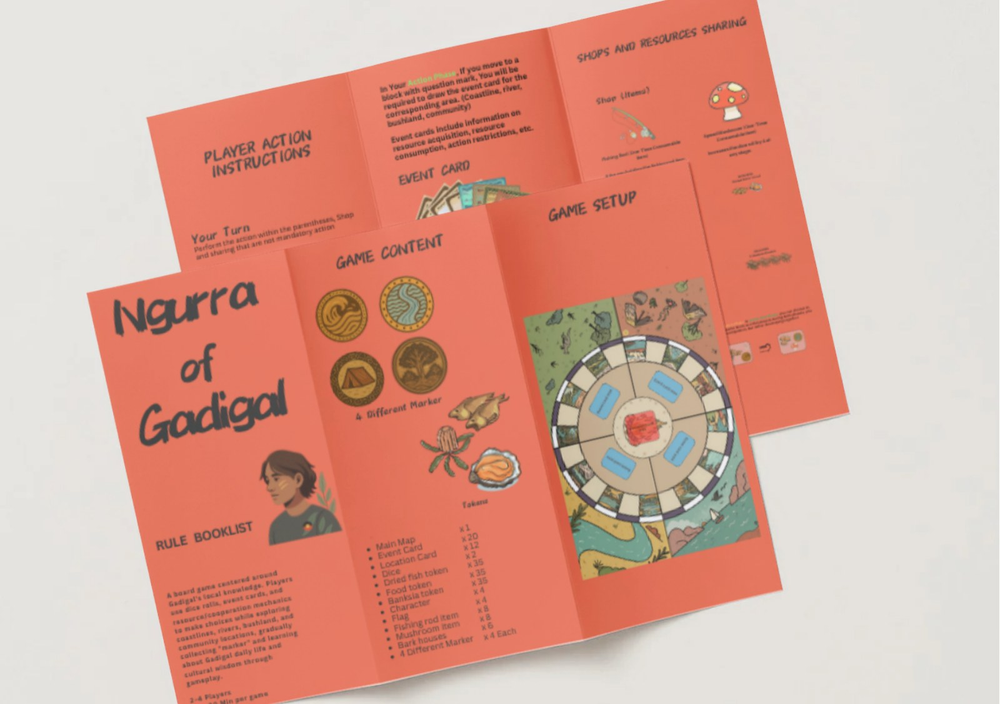

<div align="center">


<br>

[](https://sharingcountry.vercel.app/)
[](../README.md)
</div>

# Ngurra of Gadigal
### Sharing Country: Exploring Gadigal Land and Culture Through Play

**项目类型：** Graduation Studio / Team Project  
**我的角色：** Team Lead · Project Coordination · User Research · Concept Development · Experience Design  
**关键词：** `Cross-cultural Research` `User Research` `Gamification` `Place-based Learning`

**网站：** https://sharingcountry.vercel.app/

---

## 01｜Overview

悉尼大学位于 Gadigal Country，但新加入学校的国际学生往往知道“这片土地很重要”，却很难与其历史、文化和 Place 建立真实连接。

项目因此提出：

> **如何为 ADP 新学生设计一个更易理解、更具参与感，同时尊重 Gadigal 文化语境的学习体验？**



<p align="center"><sub>最终展示现场：实体桌游、规则册、网站、平板/手机界面与展览展示共同构成多触点体验。</sub></p>

---

## 02｜Research → Insight

团队结合定性与定量研究，并对 **46 名 ADP 学生**进行调研。三个关键数据直接影响后续设计方向：

| Research Finding | Insight | Design Decision |
|---|---|---|
| **56.5%** 对 Indigenous culture 没有既有了解 | 明显知识门槛 | 需要低门槛、渐进式内容 |
| **54%** 更偏好室内文化活动 | 传统户外活动并不适合所有人 | 采用室内桌游体验 |
| **80.4%** 认为有趣/互动方式能帮助文化理解 | 参与感比静态阅读更有效 | 采用游戏化、视觉化学习 |

### 四类理解障碍

**01 · Knowledge Gap**  
新成员缺乏基本历史语境，容易停留在“知道”而非“理解”。

**02 · Language & Translation**  
“Country”等概念不能简单等同为地理地点，语言转换容易丢失语境。

**03 · Place Disconnection**  
如果文化知识与真实地点、行动和参与方式脱节，就容易成为抽象背景信息。

**04 · Fear of Misunderstanding**  
面对复杂文化议题，用户可能担心说错、理解错，从而降低参与意愿。



---

## 03｜Problem Definition

我们没有把问题定义为“怎样提供更多文化信息”，而是重新表述为：

> **怎样把复杂、容易失去语境的文化知识，转化成国际学生愿意进入、能够参与并逐步理解的体验？**

因此，设计目标从 **Reading** 转向 **Co-creating through Play**。

```text
Static information
      ↓
Exploration + Action + Sharing
      ↓
Place-based understanding
```

---

## 04｜Design Strategy

### Place-based
游戏使用真实地点与区域概念，让文化信息重新连接到 Sydney/Gadigal Country 的具体空间。

### Visual-first
通过地图、卡片和图像降低大段文本带来的理解负担。

### Collaborative
游戏机制强调 sharing 与 mutual benefit，而不是单纯竞争。

### Low-barrier
通过 Rulebook、Website、QR Code 和实体引导降低第一次参与的焦虑。

---

## 05｜Experience System

地图围绕不同环境区域展开，玩家通过骰子移动并进入事件：

- 🌊 Ocean
- 💧 Rivers
- 🌿 Bush
- 🏘 Communities

资源与事件会根据区域变化。玩家需要在不同情境中做出决策、交换资源、完成任务，并在过程中理解 Sharing Country 的概念。

### 体验触点

`Board Game` → `Event Cards` → `Resources` → `Rulebook` → `Website` → `Mobile / Tablet`

<table>
<tr><td></td><td></td></tr>
</table>

---

## 06｜My Contribution

在 5 人团队中，我承担组长与协调角色，并重点参与：

- 将模糊 Brief 拆解成 Context / User / Problem / Mechanism 等研究任务
- 组织团队进行独立调研与共享文档汇总
- 推动概念比较、讨论与方向选择
- 参与用户问题、文化理解障碍与设计机会的梳理
- 协调任务、进度、阶段汇报与导师反馈
- 参与桌游体验逻辑、信息层级和最终展示系统的推进

我在这个项目里最重要的学习是：

> **用户研究不是证明原有方案正确，而是帮助团队先找到真正值得解决的问题。**

---

## 07｜Final Outcome

最终交付形成一个完整的多触点体验系统：

- 实体 Board Game
- Event / Location Cards
- Resources & Token System
- Rulebook
- Introductory Website
- Mobile / Tablet touchpoints
- Exhibition presentation

<div align="center">

[](https://sharingcountry.vercel.app/)

</div>
